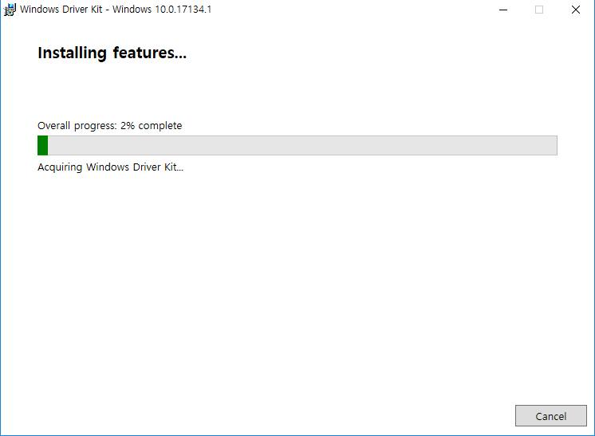
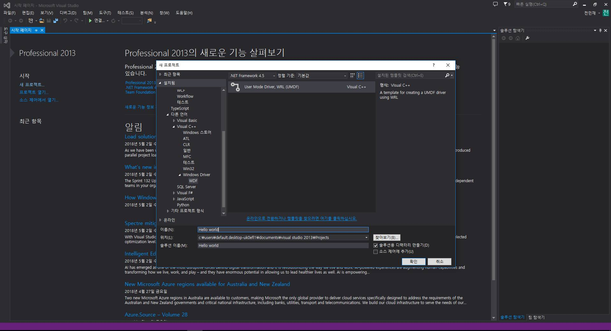
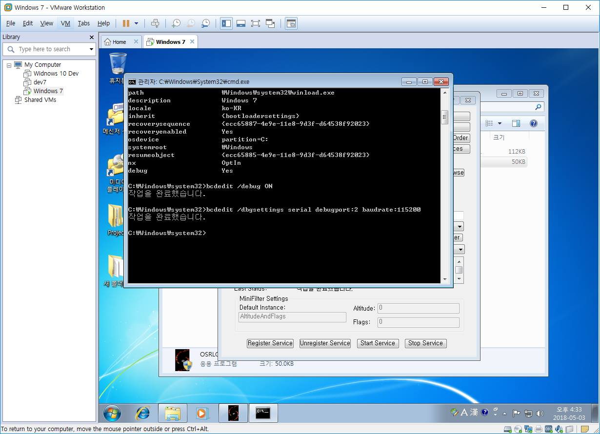
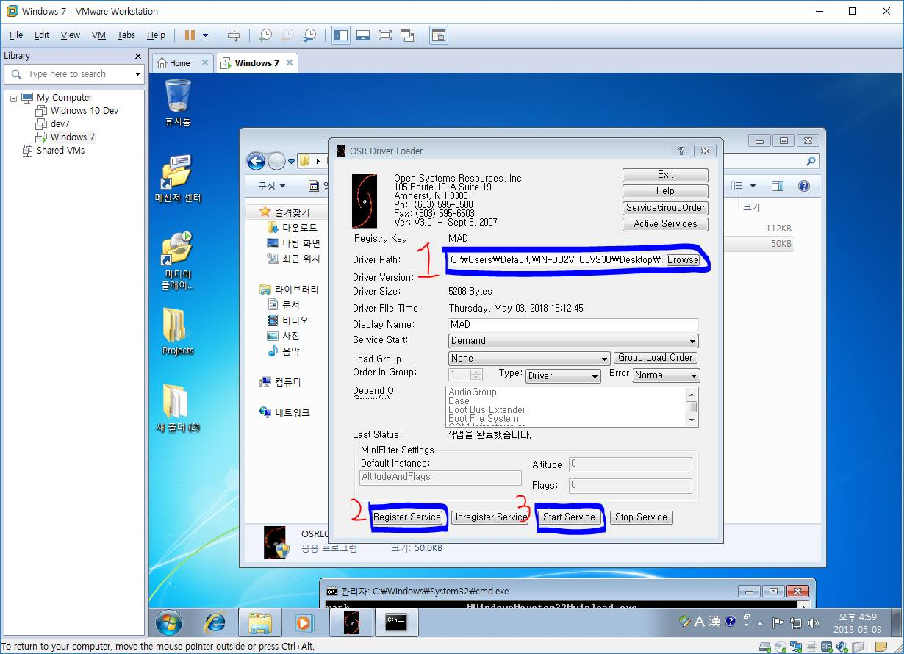
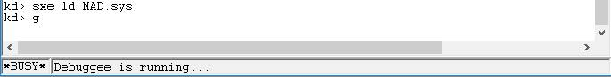
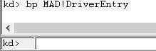
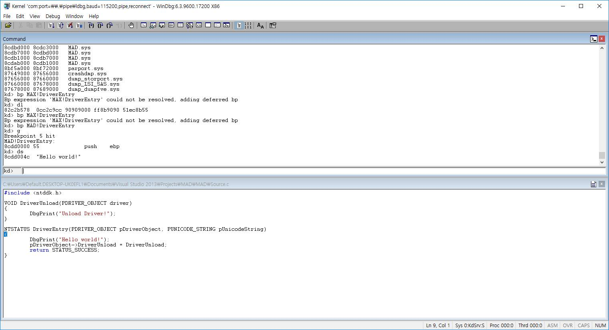

```
---
layout: post
title: "Window Kernel Driver 환경 세팅"
subtitle: "Window Kernel"
date: 2018-05-08 3:00:00
background: '/blueScreen.png'
---
```

# Window Kernel Driver Develope
--------

## Insatall
--------------------
>Window Kernel Driver를 환경을 구성하기 위해서 Windows SDK와 WDK 설치가 선행이 되어야한다.

>[SDK 다운로드](https://developer.microsoft.com/en-us/windows/downloads/windows-10-sdk)은 여기이다.

>Visual studio를 이용하는 방법도 있지만 MS 홈페이지에서 지원해주니 [WDK 다운로드](https://docs.microsoft.com/en-us/windows-hardware/drivers/download-the-wdk) 여기서 다운로드를 하자
>
>사진처럼 뭐 Next 연타하고 이렇게 설치과정이 나온다.

>
>이후에 visual studio에서 프로젝트에서 c++탭에 사진처럼 User Mode Driver, WRL(UMDF) 솔루션이 생긴걸 볼수있다.


## Device Driver, Filter Driver
--------------------
Filter Driver

## Hello world!
---------------------

```C
#include <ntddk.h>

VOID DriverUnload(PDRIVER_OBJECT driver)
{
DbgPrint("Unload Driver!");
}

NTSTATUS DriverEntry(PDRIVER_OBJECT pDriverObject, PUNICODE_STRING pUnicodeString)
{
DbgPrint("Hello world!");
pDriverObject->DriverUnload = DriverUnload;
return STATUS_SUCCESS;
}
```
여기 이제 우리가 만든 드라이버를 서비스 시키고싶으면 어떻게 해야할까?

빌드시킨 sys파일을 레지스트리에 등록을 시키고 root 권한의 cmd에 아래 명령어를 쳐주면된다.
```
net start 드라이버이름
```
근데 이것도 사실 귀찮아서 이걸 한번에 처리해주는 툴이 있다.

[osr driver loader](https://www.osronline.com/article.cfm?article=157) 해당 사이트에서 다운받을수있다.

### Window Kernel Debugging using Windbg
---------------------
호스트 운영체제와 통실할 serial port를 가상머신에서 \\.\pipe\"name"형식으로 지어주면된다

맥에서도 nvram같이 커널 디버깅이 가능하도록 심볼을 준것처럼 윈도우에서도 유저레벨 cmd에서 이런 옵션을 줘야한다.

```
bcdedit
bcdedit /debug ON
bcdedit /dbgsettings serial debugport:2 baudrate:115200
```



여기서 디버거 포트는 아까 우리가 가상머신 시리얼 포트번호를 주는곳이다.

이후에 아까처럼 드라이버를 서비스시키고 windbg로 붙여서 디버깅을 시작해주면 된다.

추가로 해당 툴은 1, 2, 3 순서로 서비스시킬 드라이버 경로와 2번은 레지스트리에 올려주고 3번이 최종적으로 드라이버가 서비스된다.


```
SRV*c:\symbols*http://msdl.microsoft.com/download/symbols
```
위는 windbg에서 심볼 경로이며 이 경로로 심볼을 받아서 우리가 좀더 편하게 심볼이 살아있는 상태에서 디버깅이 가능하다.

```
.reload //아까 지정한 경로로 symbol을 load한다.
sxe ld MAD.sys //MAD라는 드라이버를 로드될때 exception
g  //go
```



드라이버를 로드시켜주면 해당 사진처럼 break가 걸립니다.

```
lm //현재 로드된 드라이버 모듈 리스트
bp MAD!DriverEntry //MAD드라이버가 DriverEntry를 호출할때 breakpoint
g
```
아래의 사진처럼 DriverEntry에 진입하면 이제 브레이크 포인트가 걸릴것이다.
```
F8 = Step In
F10 = Step Over
```



자 이러면 해당 문자열을 확인할수 있습니다!


